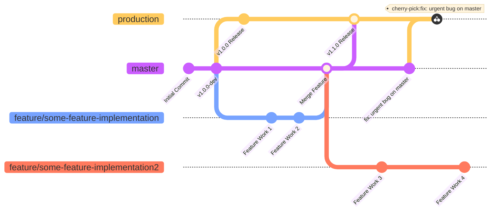

+++
title = "Git Branch Strategy"
date = "2026-06-30T18:16:33+09:00"
#dateFormat = "2006-01-02" # This value can be configured for per-post date formatting
author = "KimTalmo"
authorTwitter = "" #do not include @
cover = ""
tags = ["git"]
keywords = ["git"]
description = "개인 프로젝트 진행시 사용하는 나만의 Git 브랜치 전략"
showFullContent = false
readingTime = false
hideComments = false
+++

# Custom Gitlab Flow Strategy

사실 혼자 개발하는 경우 Git을 단순히 버전관리 용도로 사용해도 좋다. 오히려 브랜치를 나누고 개발하는게 더 복잡하고 불필요한 경우도 있다고 생각한다. 하지만 나는 브랜치를 나누고 개발하는게 이슈 트래킹, CI/CD, 레지스트리 최적화 등의 장점이 있다고 생각하여 혼자 개발할때도 브랜치를 나누고 개발한다.

## 1. Git 브랜치 전략

브랜치를 나누고 관리하는 전략은 대표적으로 3가지가 있다. Git Flow, Github Flow, Gitlab Flow.

1. Git Flow

master와 develop브랜치를 평행하게 가져가고, feature 브랜치는 develop에서 분기하 다시 develop로 병합한다. 새 버전 배포를 위해 develop 브랜치에서 release 브랜치를 분기하고, release 브랜치에서 충분한 테스트와 버그픽스 후 master 브랜치로 병합한다. master에 병합된 커밋은 태그로 버저닝 하며, 실제 배포가 일어난다.

정교하고 좋은 전략이지만 혼자 개발하는 경우엔 master, develop, release 브랜치에 추가로 feature와 hotfix 브랜치까지 너무 브랜치가 많고 관리하기 불편할 수 있다. 또한 배포된 코드에서 버그가 발생하는 경우 master에서 브랜치를 분기하여(hotfix) 오류를 수정하고 다시 master에 병합하게 되는데, 이때 이 커밋을 develop 브랜치에 병합(backport)하지 않으면 다음 배포때 같은 버그가 또 생기는 경우가 생길 수 있다.

2. Github Flow

과감하게 기본 브랜치를 master 하나만 유지하고, master에서 분기한 feature 브랜치에서 개발 후 pull request를 이용해 다시 master로 병합하는 방식이다. master에 커밋이 모이고 일반적으로 여기서 바로 릴리즈 한다. 따라서 pull request시에 코드 리뷰를 꼼꼼하게 하고 자동화된 코드 검증으로 잘못된 코드가 master에 병합되지 않게 주의를 기울여야 한다.

3. Gitlab Flow

Git Flow와 유사하지만 조금 더 간단한 대안이다. master에서 분기해 feature를 개발하며, 다시 master로 병합한다. 릴리즈 시에는 master에서 production 브랜치로 커밋들을 병합하고 배포한다. 또한 필요에 따라 master와 production 브랜치 사이에 pre-production 브랜치를 두어 테스트를 위한 시간을 확보하고, QA를 위한 배포를 할 수 있다. 릴리즈된 브랜치를 유지하고 버그픽스 커밋만 체리픽하여 여러 버전을 동시에 관리 할 수도 있다.

Git Flow와의 주요 차이점은 Upstream first 방식을 사용한다는 점이다. 릴리즈에서 버그를 발견한 경우 Git Flow와 다르게 master에서 버그를 수정한 후 production 브랜치에서 해당 커밋을 체리픽한다. 위에서 설명한 pre-production 방식과 여러 버전을 동시에 관리하는 버전 또한 master 브랜치에서 커밋 후 각각의 브랜치로 머지 또는 체리픽 되는 방식이다. 즉 오리지널(Upstream, 여기서는 master) 브랜치에 먼저(first) 반영하고 나머지 브랜치는 오리지널로부터 가져오는 방식이다. Upstream first 방식은 여러 장점이 있지만 개인적으로는 잘만 사용한다면 merge시 충돌이 적다는 장점이 좋다고 느껴졌다.

## 2. 나의 브랜치 전략

나는 혼자 개발할때 Gitlab flow를 단순화한 전략을 사용한다.

1. master 브랜치 1개를 default 브랜치로 설정하고 해당 브랜치를 Upstream으로써 다룬다.
2. feature 브랜치는 master로부터 분기하되 이름을 feature/* 방식으로 지어 구분하기 편하게 하였다. 개발이 완료되면 반드시 리베이스하고, 로컬에서 병합하거나 웹 UI에서 Merge request를 보낸다. 이때 fast forward merge를 사용하지 않는다.
3. 릴리즈 시에는 로컬에서 직접 master에서 production으로 병합하고 배포 버전을 태깅해서 push하는 방식으로 사용한다.
4. 단순 버그는 issue 등록 후 feature와 똑같이 다룬다.
5. hotfix는 별도의 브랜치를 만들지 않고 master에서 직접 오류 수정 후 production으로 cherry-pick 한다.

1인 개발 규모에 맞게 staging(pre-production) 브랜치 없지 master와 production 2개만 가져가는 방식을 선택했다. 버그 픽스는 이슈를 남겨 이슈 트래킹이 가능하게 하고 머지 커밋을 반드시 남겨 추후에 로그를 볼때 조금 더 구분이 편하도록 하였다. hotfix는 production으론 체리픽되고 기존 feature브랜치는 병합시 리베이스 할때 적용된다.

## 3. 마무리

이 브랜치 전략을 사용하면서 Gitlab의 CI/CD 기능을 사용해서 일반 브랜치는 자동 테스트, production 브랜치는 docker image 빌드 후 Gitlab container registry 등록이 자동으로 되게 하였다. Git이 협업을 위한 툴이라는 이미지가 크지만 엄밀하게는 버전 관리 시스템이고 잘 활용한다면 혼자 개발할때도 이점이 아주 크다고 생각한다. 또한 요즘처럼 AI를 활용한 개발을 할 때 브랜치를 나눠 서로 다른 context를 가져가거나 작업이 길어질때 하나의 체크포인트처럼 활용하기도 한다.

최근에는 Jujutsu라는 Git 호환 버전관리 시스템이 주목받고 있는것 같다. Git을 사용하던 레포지토리에서 그대로 사용할 수 있으며 더 단순하고 사용하기 쉬우면서도 강력하다고 한다. 새로 배우고 싶은게 많지만 Jujutsu는 그중에서도 가장 배우고 싶은 것중 하나이다! 지금 학습하고 있는게 끝나면 잠깐 시간을 내어 익혀봐야겠다.