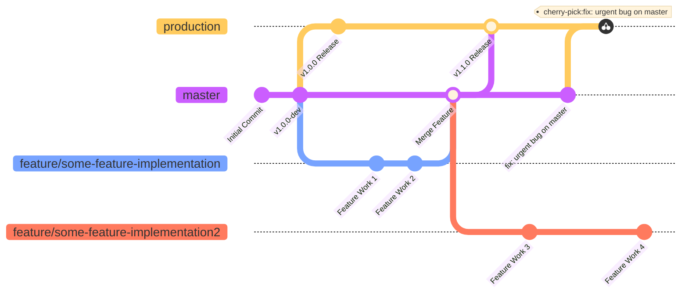

+++
title = "Git Branch Strategy"
date = "2026-06-30T18:16:33+09:00"
#dateFormat = "2006-01-02" # This value can be configured for per-post date formatting
author = "KimTalmo"
authorTwitter = "" #do not include @
cover = ""
tags = ["git"]
keywords = ["git"]
description = "개인 프로젝트 진행시 사용하는 나만의 Git 브랜치 전략"
showFullContent = false
readingTime = false
hideComments = false
+++

# Custom GitLab Flow Strategy

사실 혼자 개발하는 경우 Git을 단순히 버전 관리 용도로만 사용해도 충분하다. 오히려 브랜치를 나누어 개발하는 것이 더 복잡하고 불필요하게 느껴질 때도 있다. 그럼에도 불구하고 내가 1인 개발 시에도 브랜치를 나누는 이유는 이슈 트래킹, CI/CD 파이프라인 연동, 컨테이너 레지스트리 최적화 등 관리 효율성 측면에서 얻을 수 있는 장점이 크기 때문이다.

## 1. Git 브랜치 전략

대표적인 Git 브랜치 관리 전략으로는 **Git Flow**, **GitHub Flow**, **GitLab Flow** 세 가지가 있다.

### 1. Git Flow

`master`와 `develop` 브랜치를 중심 축으로 삼고 평행하게 유지하는 방식이다. 새로운 기능은 `develop` 브랜치에서 `feature` 브랜치를 분기하여 개발한 뒤 다시 `develop`에 병합한다. 배포 시점이 되면 `develop` 브랜치에서 `release` 브랜치를 분기하여 테스트와 버그 수정을 거친 후, 최종적으로 `master` 브랜치에 병합한다. `master` 브랜치에 병합된 커밋은 태그를 달아 버저닝을 하고 실제 프로덕션 배포로 이어진다.

이 전략은 체계적이고 대규모 협업에 좋지만, 혼자 개발할 때는 관리해야 할 브랜치(`master`, `develop`, `release`, `feature`, `hotfix` 등)가 너무 많아 다소 번거로울 수 있다. 또한 배포된 코드에서 버그가 발생하여 `master`에서 `hotfix` 브랜치를 분기해 수정한 경우, 이 커밋을 `develop` 브랜치에도 역방향 병합(Backport)해야 한다. 만약 이 과정을 누락하면 다음 배포 때 동일한 버그가 다시 발생하는 위험이 있다.

### 2. GitHub Flow

기본 브랜치로 `master` 하나만 유지하는 매우 단순한 방식이다. `master`에서 분기한 `feature` 브랜치에서 기능을 개발하고, Pull Request(PR)를 통해 다시 `master`로 병합한다. 모든 변경 사항이 `master`로 직접 합쳐지며, 합쳐지는 즉시 프로덕션 배포가 이루어지는 것이 일반적이다. 따라서 잘못된 코드가 배포되는 것을 막기 위해 PR 단계에서 철저한 코드 리뷰와 CI를 통한 자동화 검증이 필수적이다.

### 3. GitLab Flow

Git Flow의 복잡함을 덜어낸 실용적인 대안이다. 기본적으로 `master` 브랜치에서 `feature` 브랜치를 분기해 개발한 후 `master`에 병합한다. 배포할 때는 `master` 브랜치에서 배포용 브랜치(`production` 등)로 병합하여 릴리즈를 진행한다. 필요한 경우 `master`와 `production` 사이에 `pre-production` 브랜치를 두어 스테이징 환경에서 QA 및 테스트를 진행할 수도 있다.

Git Flow와의 가장 큰 차이점은 **Upstream First** 원칙을 따른다는 점이다. 프로덕션 환경(릴리즈 버전)에서 버그가 발견되면 `master` 브랜치에서 먼저 버그를 수정한 뒤, 해당 커밋을 `production` 브랜치로 체리픽(Cherry-pick)하거나 머지한다. 즉, 항상 오리지널 브랜치(Upstream, 여기서는 `master`)에 변경 사항을 먼저 반영하고 다른 브랜치로 전파하는 구조다. 이 방식은 흐름이 단방향으로 유지되므로 브랜치 간의 병합 충돌(Conflict)이 발생할 확률을 크게 낮춰준다.

## 2. 나의 브랜치 전략

나는 1인 프로젝트를 진행할 때 GitLab Flow를 더욱 직관적으로 단순화한 전략을 사용하고 있다.

1. `master` 브랜치를 기본(default) 브랜치로 설정하고, 모든 개발의 기준이 되는 Upstream으로 다룬다.
2. 기능 개발은 `master`에서 분기한 `feature/*` 브랜치에서 진행하여 브랜치 구분을 명확히 한다. 개발 완료 후에는 로컬에서 대상 브랜치로 리베이스(Rebase)를 마친 뒤, 웹 UI에서 Merge Request(MR)를 보내거나 로컬에서 병합한다. 이때 히스토리 추적을 위해 Fast-forward 머지는 사용하지 않는다 (Non-Fast-Forward Merge).
3. 배포(릴리즈) 시에는 로컬에서 `master` 브랜치를 `production` 브랜치로 병합하고, 배포 버전에 맞는 태그(Tag)를 생성한 뒤 원격에 Push한다.
4. 일반적인 버그 수정은 이슈(Issue) 등록 후 `feature` 브랜치와 동일한 프로세스로 진행한다.
5. 긴급 버그 수정(Hotfix)의 경우, 별도의 브랜치를 분기하지 않고 `master`에서 직접 수정한 후 `production` 브랜치로 체리픽(Cherry-pick)하여 반영한다.

이처럼 1인 개발 규모에 맞게 복잡한 `staging(pre-production)` 브랜치 없이 `master`와 `production` 2개 브랜치만으로 운영한다. 버그 픽스는 이슈 트래킹을 연동해 기록을 남기고, 병합 시에는 머지 커밋(Merge Commit)을 남겨 나중에 로그를 확인하기 쉽게 구성했다. 또한 `hotfix`는 `production`으로 즉시 체리픽되고, 진행 중인 `feature` 브랜치들은 향후 리베이스를 진행할 때 자연스럽게 수정 사항을 흡수하게 된다.

## 3. 마치며

이 브랜치 전략을 도입하면서 GitLab CI/CD 기능을 연계해 사용하고 있다. `feature` 브랜치는 코드 푸시 시 자동 테스트를 수행하고, `production` 브랜치는 Docker 이미지 빌드 후 GitLab Container Registry에 자동 등록되도록 파이프라인을 구축했다.

흔히 Git을 협업용 도구로만 생각하기 쉽지만, 본질은 버전 관리 시스템인 만큼 혼자 개발할 때도 규칙을 정해 활용하면 큰 이점을 얻을 수 있다. 특히 최근처럼 AI 어시스턴트를 활용해 개발할 때는 브랜치를 쪼개어 작업 컨텍스트를 분리하거나, 장기 작업 시 안전한 체크포인트로 삼기에 매우 유용하다.

최근에는 Git 호환 버전 관리 시스템인 **Jujutsu(jj)**가 주목받고 있는 듯하다. 기존 Git 리포지토리 환경에서 그대로 사용할 수 있으면서도, 한결 직관적이고 강력한 기능을 제공한다. 앞으로 배울 것들이 많지만 Jujutsu는 그중에서도 우선순위가 높다. 현재 진행 중인 학습이 마무리되면 시간을 내어 꼭 배워볼 생각이다.